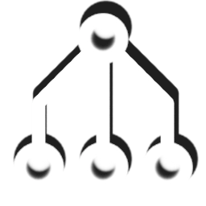

#  On Gracious

> The mind is information and all information can be simulated. Gracious operates on the premise that, A ⊙ M = MO.
> (i.e. An associational signal can evoke the properties of M in MO without M's presence). Given that A and M are both
> distributed signal representations, a form of data representation which retains and communicates both meaning and
> state, then a system built on these parameters is a conscious system. And Gracious is for building conscious systems.

## A Collection of Cognitive Operations

Gracious is a collection of operators for the construction of the cognitive systems which give rise to consciousness.
While these systems are inspired by their biological implementations in the human brain, this is not meant to be
neuro-biological simulation.  Furthermore, while the behaviour of these systems may exhibit properties of a
"learning machine" this is not a machine learning framework. There is no back-propagation or gradient descent.
Instead, Gracious rests, fundamentally, on the processing of associative operations between distributed signal
representations.

## The Theory

The theory behind Gracious is largely based on the works of Dr. Pentti O. Haikonen. Dr. Haikonen developed the Haikonen
Associative Neuron and the Haikonen Cognitive Architecture which Gracious structures are largely inspired by. Several
modifications have been made to Dr. Haikonen's designs. Dynamic neuron groups and an optimized 3:1 Hebbian learning have
been added in the name of improved computational efficiency. These modifications have maintained there efficacy and are
comparable in output. Other modifications, including qualar dispatch multi-pathing and bipolar associations have been
added to improve on Haikonen's original designs. Descriptions of all terms and their implications are available in the
[docs](docs) under [theory](docs/theory). These concepts are not critical to the high-level operation of Gracious
simulations. 

## Getting Started

Gracious is not a 